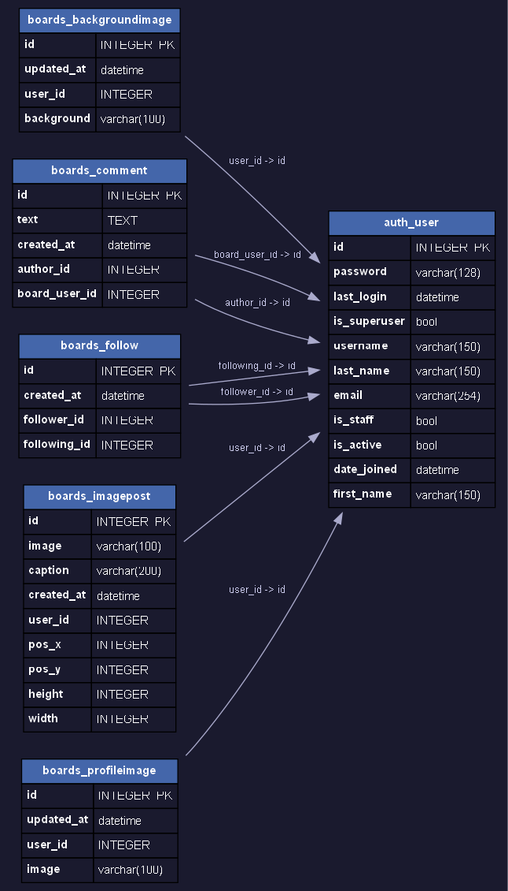

# ChillBoard

Projekt v okviru predmeta Podatkovne baze 1.

Spletna aplikacija, kjer si vsak uporabnik ustvari svojo **tablo** (board) in nanjo prilepi slike v obliki kolaža. Drugi uporabniki lahko ploščo ogledajo, jo komentirajo in sledijo njenemu lastniku.

---

## Funkcionalnosti

- Registracija in prijava uporabnikov
- Nalaganje, premikanje in spreminjanje velikosti slik na plošči
- Nastavitev profilne slike in ozadja plošče
- **Sledenje** uporabnikom – sledeni se prikažejo na vrhu seznama vseh uporabnikov
- **Komentiranje** plošč – prijavljeni uporabniki lahko pustijo komentar na kateri koli plošči
- Tekstovni vmesnik (`Tekstovni_vmesnik.py`) za upravljanje slik brez brskalnika

---

## Zagon

### Lokalno (brez Dockerja)
```bash
pip install -r requirements.txt
python manage.py migrate
python manage.py runserver
```

### Z Dockerjem
```bash
docker-compose up --build
```
Aplikacija je dostopna na http://localhost:8000.

### Vzorčna baza
Preimenuj `Example_database.sqlite3` v `db.sqlite3`.  
Gesla testnih profilov so oblike `X12341234`, kjer je `X` začetnica uporabniškega imena.

---

## Podatkovna shema

### ER diagram



### Razlaga tabel

| Tabela | Opis |
|--------|------|
| **auth_user** | Djangova vgrajena tabela za uporabnike. Vsebuje podatke o prijavi (username, password, email) in pravicah. |
| **boards_imagepost** | Slika na plošči posameznega uporabnika. Poleg poti do datoteke hrani koordinate (`pos_x`, `pos_y`) in dimenzije (`width`, `height`) za prikaz na plošči. |
| **boards_backgroundimage** | Ozadje plošče. Vsak uporabnik ima natanko eno ozadje (1 : 1 z `auth_user`). |
| **boards_profileimage** | Profilna slika. Vsak uporabnik ima natanko eno profilno sliko (1 : 1 z `auth_user`). |
| **boards_follow** | Relacija sledenja med dvema uporabnikoma. `follower_id` sledi `following_id`. Kombinacija je edinstvena, da ne pride do podvajanja. |
| **boards_comment** | Komentar na plošči. `board_user_id` je lastnik plošče, `author_id` je avtor komentarja. |

### Povezave med tabelami

```
auth_user 1──< boards_imagepost       (en uporabnik ima lahko več slik)
auth_user 1──1 boards_backgroundimage (vsak uporabnik ima natanko eno ozadje)
auth_user 1──1 boards_profileimage    (vsak uporabnik ima natanko eno profilno sliko)
auth_user 1──< boards_follow          (kot follower: en uporabnik sledi več drugim)
auth_user 1──< boards_follow          (kot following: enemu uporabniku sledi več drugih)
auth_user 1──< boards_comment         (kot avtor: eden napiše več komentarjev)
auth_user 1──< boards_comment         (kot lastnik plošče: plošča ima več komentarjev)
```

---

## Opomba: opis slike v tekstovnem vmesniku

Polje `caption` v `boards_imagepost` je neobvezen kratki opis slike.  
V spletnem vmesniku se prikaže kot `alt` atribut (nadomestno besedilo, kadar se slika ne naloži) **in** kot viden napis pod sliko.  
V tekstovnem vmesniku (`Tekstovni_vmesnik.py`) se opis prikazuje v stolpcu *Opis* pri pregledu slik, kar omogoča lažjo identifikacijo brez odpiranja datotek.

---

## Generiranje ER diagrama

Diagram je ustvarjen s skriptom `generate_er.py`, ki prebere shemo iz `db.sqlite3`, generira datoteko `.dot` in jo pretvori v PNG z orodjem [Graphviz](https://graphviz.org/).

```bash
python generate_er.py
```
